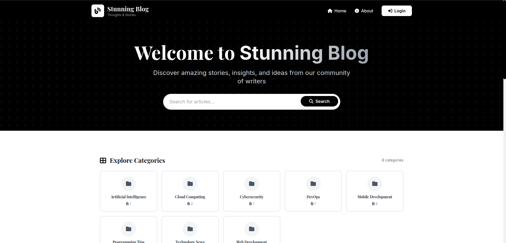
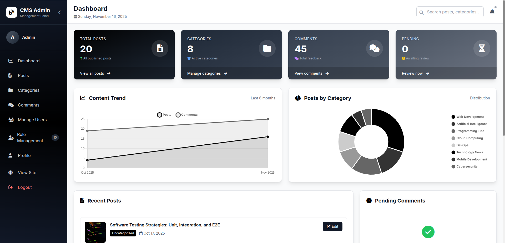
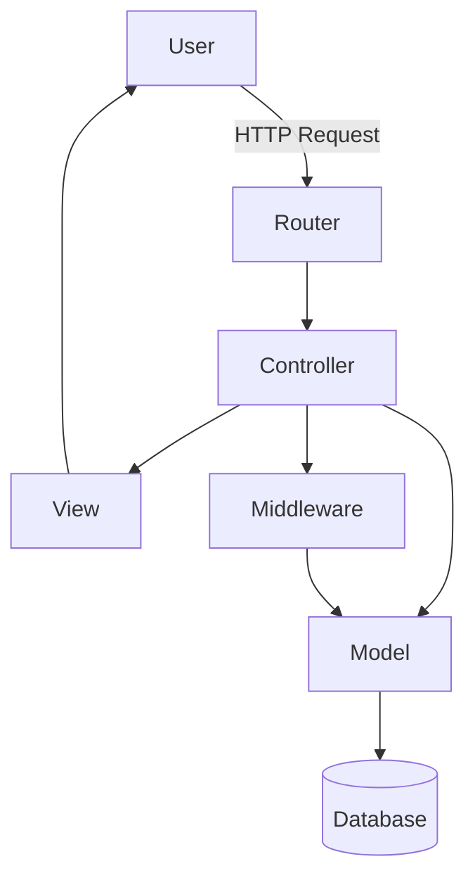
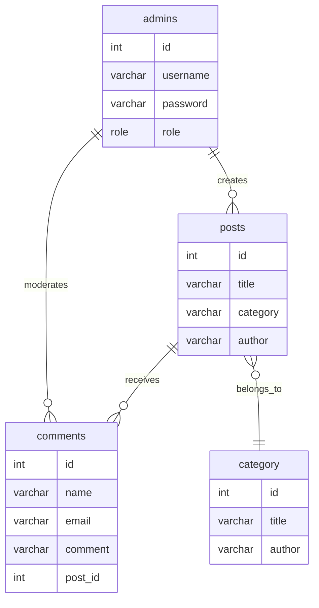
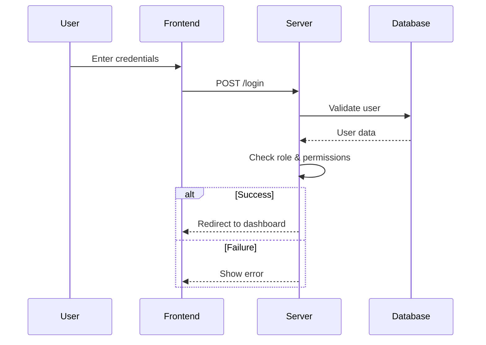
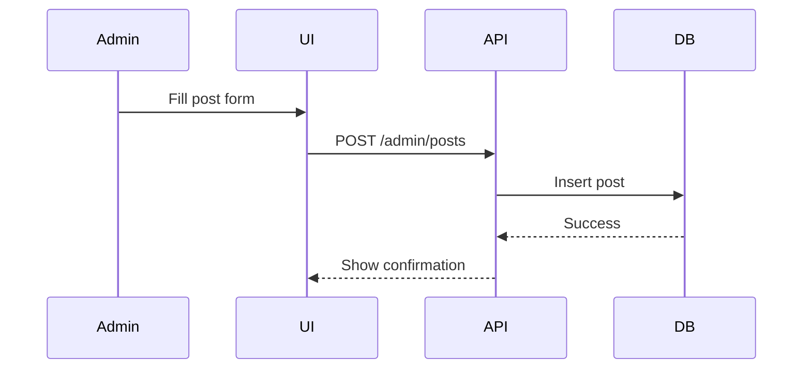

# CMS Stunning Blog


## Table of Contents

- [Overview](#overview)
- [Features](#features)
- [Screenshots](#screenshots)
- [Architecture](#architecture)
- [Database Schema](#database-schema)
- [Workflow Diagrams](#workflow-diagrams)
- [Setup & Installation](#setup--installation)
- [Role Management](#role-management)
- [Contributing](#contributing)
- [License](#license)

---

## Overview

**CMS Stunning Blog** is a modern, enterprise-grade Content Management System (CMS) designed for robust blogging, role-based access, and seamless admin workflows. Built with PHP, it features a modular architecture, clean routing, and a professional admin panel.

---

## Features

- Multi-role user management (Super Admin, Admin, Editor, Author)
- Secure authentication & session management
- RESTful routing
- Admin dashboard with search, post, category, comment, and user management
- Blog with categories, comments, and user profiles
- Migration scripts and setup automation
- Modern UI/UX for both admin and public views

---

## Screenshots


### Home Page


### Website View


### Admin Panel


### Role Management


---

## Architecture

### High-Level Architecture



- **Router**: Maps URLs to controllers and methods
- **Controller**: Handles business logic and user input
- **Model**: Interacts with the database
- **View**: Renders HTML for the user
- **Middleware**: Handles authentication, roles, and permissions

---

## Database Schema

### Entity-Relationship Diagram



---

## Workflow Diagrams

### User Login & Role Check



### Post Creation (Admin/Editor)



---

## Setup & Installation

1. **Clone the repository**
   ```sh
   git clone <repo-url>
   cd CMS-Stunning_Blog
   ```
2. **Install dependencies**
   ```sh
   composer install
   ```
3. **Configure the database**
   - Edit `config/database.php` with your DB credentials.
   - Import `C.M.S.sql` into your MySQL server.
4. **Run role management migration**
   ```sh
   bash setup_roles.sh
   ```
5. **Set up web server**
   - Use `nginx.conf.example` as a template for your Nginx config.
   - Point your web root to `public/`.

---

## Role Management

- Roles: `super_admin`, `admin`, `editor`, `author`
- Assign and manage roles via the admin panel or `setup_roles.sh` script
- Permissions are enforced in controllers and middleware
- See `src/Core/Role.php` and `src/Core/Session.php` for implementation details

---

## Contributing

1. Fork the repo
2. Create a feature branch
3. Commit your changes
4. Open a pull request

---

## License

This project is licensed under the MIT License.
